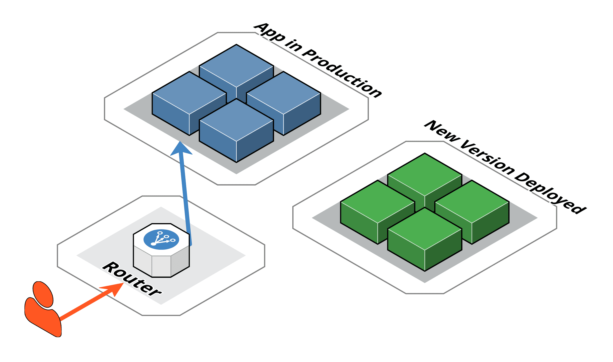
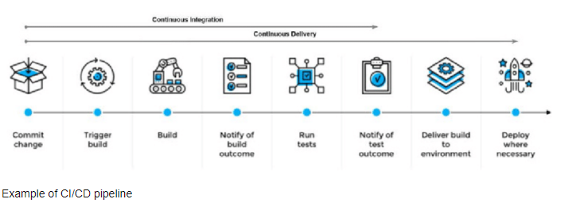
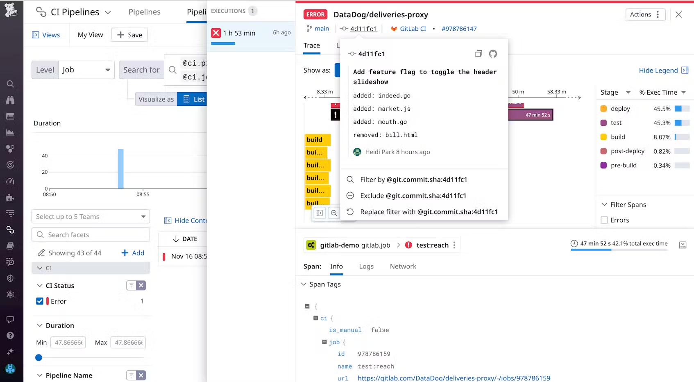
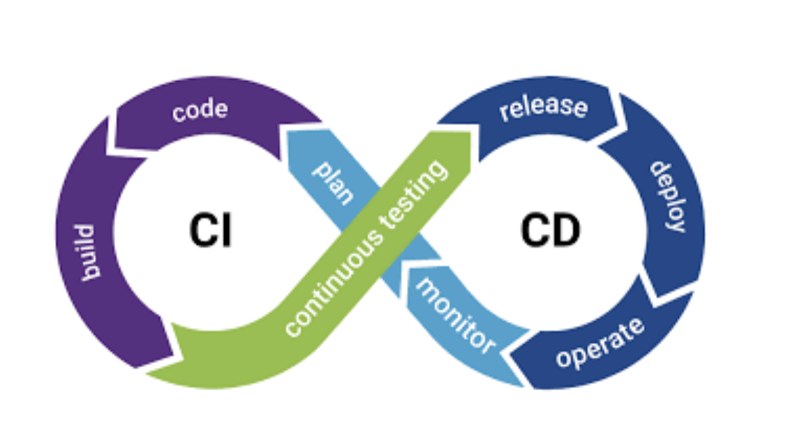
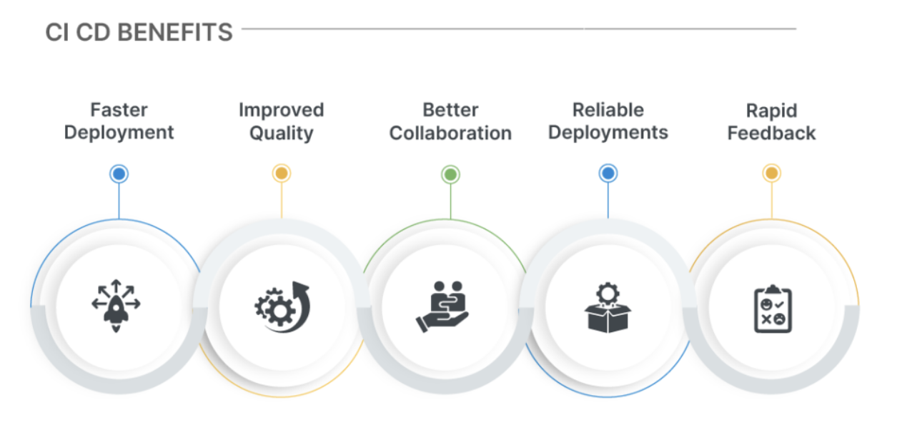
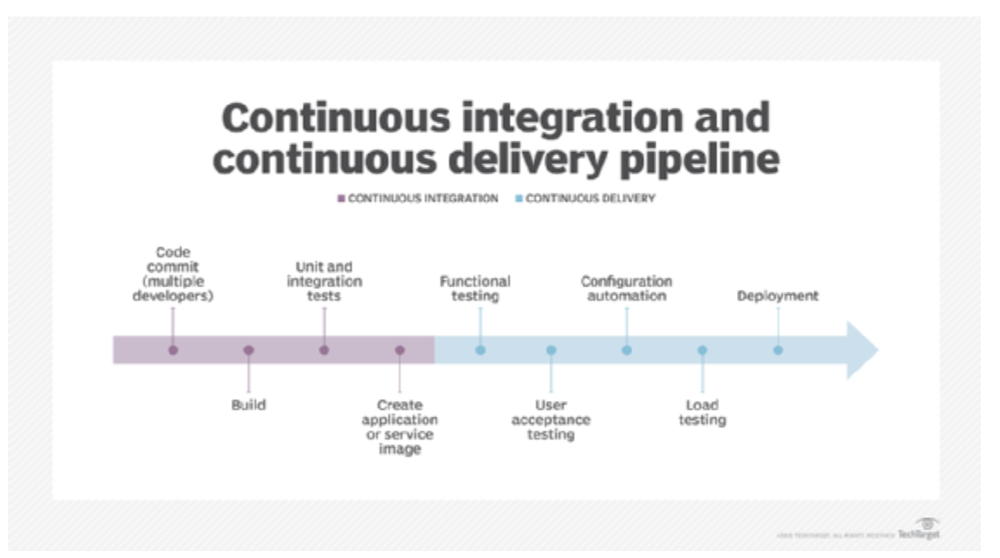
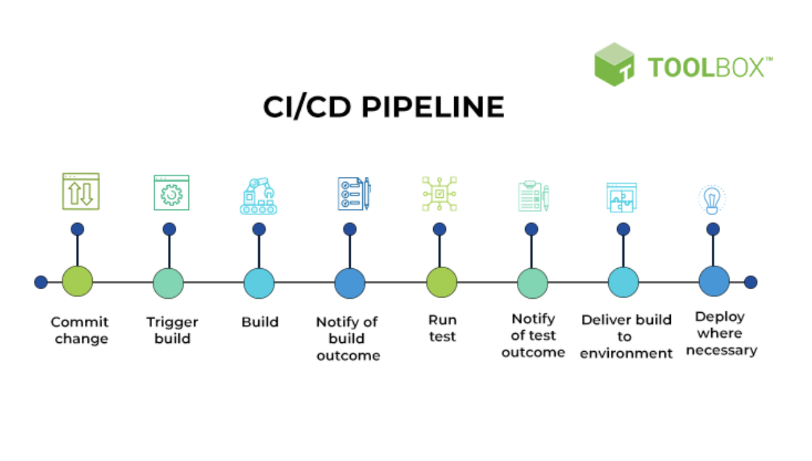

# Continuous Integration (CI) & Continuous Delivery (CD)

### Resources: 
-  [Tools for CI/CD](https://blog.jetbrains.com/teamcity/2023/08/how-to-choose-cicd-tool/ )
- [Quality and CI/CD](https://qameta.io/blog/automated-testing-for-ci-cd/)
-  [Blog on CI/CD Pipelines](https://komodor.com/blog/ci-cd-pipelines-for-kubernetes-best-practices-and-tools/) 
- [Blog on CI/CD Monitoring Practices](https://www.datadoghq.com/blog/best-practices-for-ci-cd-monitoring/) 
- [Blog: Fulfilling the promise of CI/CD](https://stackoverflow.blog/2021/12/20/fulfilling-the-promise-of-ci-cd/) 
-  [Pros and Cons of CI/CD Pipelines - BairesDev](https://www.bairesdev.com/blog/pros-and-cons-of-ci-cd-pipelines/)
- [The Pros and Cons of CI/CD Pipelines - TechTarget](https://www.techtarget.com/searchsoftwarequality/tip/The-pros-and-cons-of-CI-CD-pipelines)
- [Pros and Cons of CI/CD Pipelines - Medium](https://manrai-tarun.medium.com/pros-and-cons-of-ci-cd-pipelines-1d9c1ec1d242)

## What is CI/CD and Its Impact on Software Quality

CI/CD stands at the core of modern software development methodologies, emphasizing automation, collaboration, and rapid feedback loops to enhance software quality. The approach reduces human error and ensures software is always in a release-ready state, facilitating faster and more reliable releases.

- **Automation and Feedback**: Automates integrating code changes, running tests, and deploying applications for rapid issue feedback.
- **Frequent Releases**: Enables more frequent releases, improving user and stakeholder feedback loops.
- **Early Bug Detection**: Helps in detecting bugs early in the development process.
- **Reliability and Speed**: Ensures fast and reliable deliveries by automating the deployment process.

## CI/CD Best Practices and Guidelines

- **Automated Testing**: Validate code changes through automated tests.
- **Deployment Strategies**: Utilize strategies like blue/green deployments to minimize risks.

- **Security First Approach**: Prioritize security throughout the CI/CD pipeline.
- **Scalability and Maintenance**: Opt for tools that support scalability and easy maintenance.
- **Effective Use of Docker**: Optimize Docker usage in CI/CD pipelines.
- **Monitoring and Metrics**: Implement monitoring and metrics for visibility and troubleshooting.

## Tools for Implementing CI/CD Best Practices
 
### 1. Automated Testing
 
- **Tools**: Jenkins, Travis CI, GitLab CI, CircleCI
- **Usage**: Trigger automated tests for every commit or pull request. These tools can run various automated tests to ensure code changes do not break existing functionalities.
 
### 2. Deployment Strategies
 
- **Tools**: Spinnaker, Argo CD, Flux
- **Usage**: Support advanced deployment strategies and automate rollout processes for risk minimization.
 
### 3. Security First Approach
 
- **Tools**: Snyk, SonarQube, Aqua Security
- **Usage**: Integrate these tools early in your CI/CD pipelines for scanning vulnerabilities and ensuring container security.
 
### 4. Scalability and Maintenance
 
- **Tools**: Kubernetes, Docker, Terraform
- **Usage**: Manage and scale containerized applications, automate deployments, and efficiently manage resources using infrastructure as code.
 
### 5. Effective Use of Docker
 
- **Tools**: Docker, Docker Compose, Docker Hub
- **Usage**: Ensure consistency across environments, define and run multi-container Docker applications, and manage Docker images.
 
### 6. Monitoring and Metrics
 
- **Tools**: Prometheus, Grafana, New Relic
- **Usage**: Monitor CI/CD pipelines and infrastructure, visualize metrics, and gain insights into application performance and health.
 

 
By leveraging these tools according to the outlined best practices, one can significantly improve the quality and reliability of the software delivery process.

# CI/CD

## Benefits and Downfalls:

### Benefits of CI/CD:
- More responsive development: CI/CD enables faster app development to meet organizational needs. Collaboration with the business side is key in prioritizing high-impact areas over technical preferences.
- Better code quality: Smaller changes mean less code and better code quality checks before full testing. This helps developers identify and solve problems earlier in the DevOps process. However, code quality is still crucial, and CI/CD does not permit cutting corners for the sake of speed.
- Shorter testing cycles: Less code to check means faster deployment. A well-run CI/CD approach involves fewer interactions between what is changed and what remains unchanged.
- Easier monitoring of change in the operational environment: Efficient monitoring tools help identify the root cause of issues during a rollout.
- Easier rollback if required: If a problem occurs that requires the platform to return to a previously known position, smaller changes mean less effort to carry out the rollback. Again, ensure the right tools are in place, especially an effective orchestration tool.

### Downfalls of CI/CD:
- Not everyone appreciates continuous change: With CI/CD, many changes are invisible to the user, but some impact the UX. It's important to communicate UX changes to users as soon as possible and provide on-screen guidance. Involve the help desk in the CI/CD process and let them see and comment on changes before they go live to avoid complaints from users.
- Changes create a domino effect in a microservices environment: In microservices with CI/CD, a small change can affect multiple interactions. Configuration management tracks dependencies between microservices, and orchestration ensures changes don't impact other streams and can be rolled back if necessary.
- Continuous change requires continuous monitoring and reporting: Real-time monitoring and reporting are crucial to quickly address any issues that may arise due to CI/CD changes and prevent cascading problems and user complaints.
- Resource management must be responsive: Deep testing is crucial for developers and testers to anticipate the resource and performance impacts of CI/CD changes. Automation and orchestration tools can help prepare and provision workloads agnostically, monitor IT platforms, and automatically take corrective actions.

