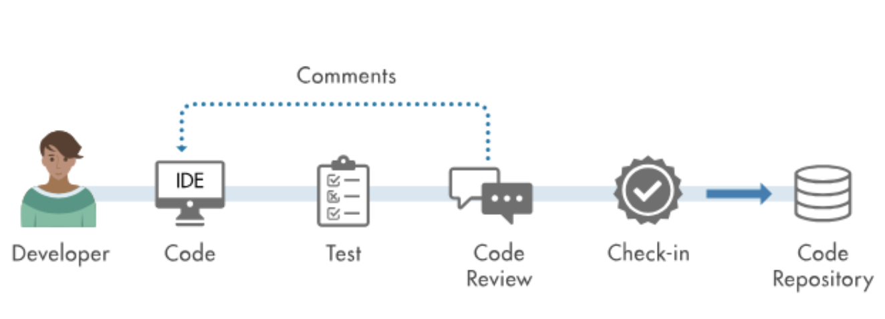
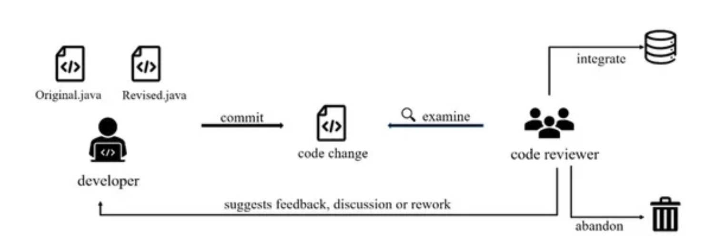
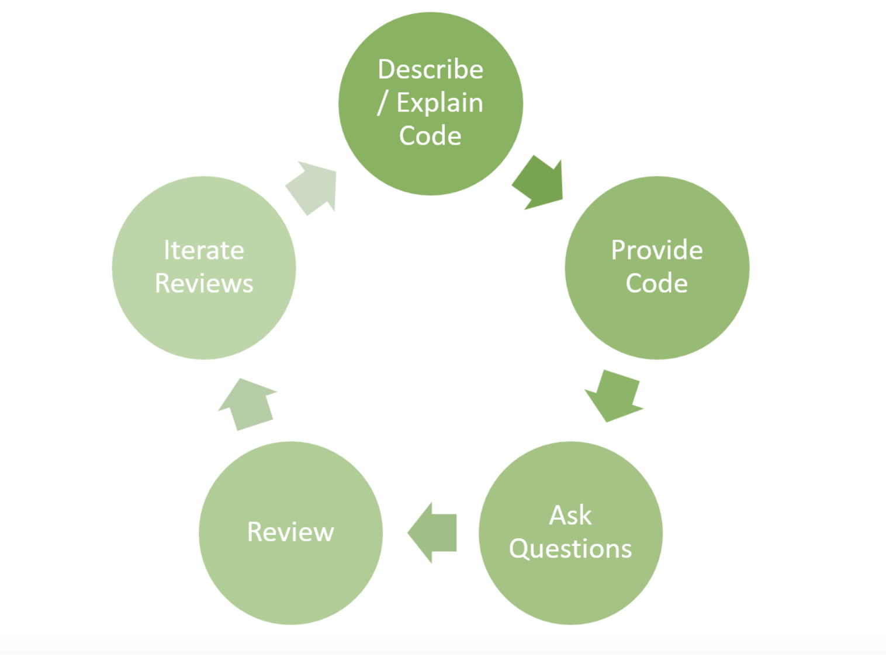
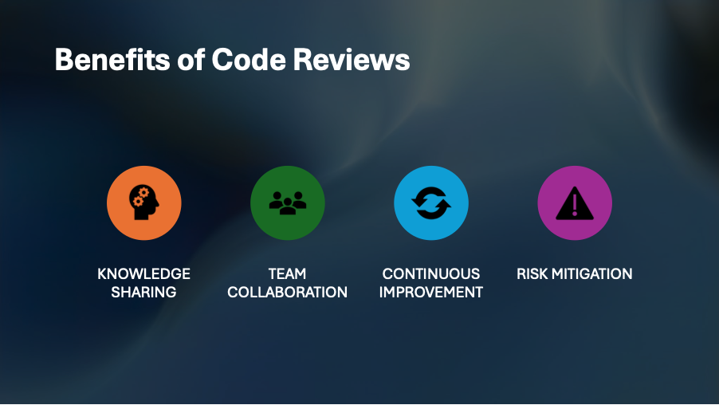

# Code Reviews

## Resources:
- [What is Code Review?](https://smartbear.com/learn/code-review/what-is-code-review/)
- [6 Reasons Why Code Reviews are Especially Important for Remote Teams](https://distantjob.com/blog/6-reasons-why-code-reviews-are-especially-important-for-remote-teams/#:~:text=C)
- [Types of Code Reviews](https://www.scrum-tips.com/agile/types-of-code-reviews/#:~:text=Type%201%2C%20the%20instant%20code,needs%20explanation%20by%20the%20coder)
- [Best Practices for Reviewing Code](https://www.codegrip.tech/productivity/best-practices-for-reviewing-code/)
- [Code Review: Pros and Cons](https://www.linkedin.com/pulse/code-review-pros-cons-umesh-kadam-1)
- [Michaela Greiler's Blog on Code Reviews](https://www.michaelagreiler.com/category/code-reviews/)

**What is Code Review:**

Peer Code Review, also known as Code Review, involves programmers collaborating to review each other's code for errors. This practice has been proven to streamline and expedite software development more than any other technique. It is an essential component of the software development lifecycle and typically occurs before merging code changes into the primary codebase. Code reviews can be performed manually or with the assistance of automated tools. Although numerous tools and software are available, comprehending the fundamental concept is critical. Software is created by humans and is susceptible to human errors. While software developers frequently rely on manuals and automated testing to verify code, it is still imperative to utilize human abilities to identify and rectify mistakes.

## Types of Code Reviews

- **INSTANT REVIEW**: This is done in pair programming and works well when two developers with similar skill sets are working on a complex business problem. It is usually performed when deadlines are tight.

- **SYNCHRONOUS REVIEW**: Particularly effective when the reviewer requires an explanation from the coder due to limited knowledge of the task's objective. This approach is commonly employed when time is of the essence, such as when addressing high-priority bug fixes or implementing urgent changes.

- **ASYNCHRONOUS REVIEW**: Used when team members are spread across the globe or have conflicting meeting schedules. These are used to prevent the problem of forced context switching and work well for the most common use cases.

- **TEAM REVIEWS**: Involve a group of developers or peers who collaborate to provide feedback on each other's code changes before integration. They allow for in-depth analysis of the code from multiple perspectives, increasing the chances of identifying defects. Additionally, they provide a valuable opportunity for knowledge sharing and collaboration.

# Purpose of Code Reviews

Conducting code reviews early in the software development process is essential for several reasons:

- **Bug Detection and Resolution:** Code reviews help catch and address potential bugs before they become bigger issues, ensuring a more robust and reliable software product.

- **Improving Code Quality:** By reviewing each other's code, developers can improve the overall quality of the codebase, leading to better performance and fewer errors.

- **Ensuring Consistency:** Code reviews promote consistency in coding style and practices among team members, making the codebase easier to understand and maintain.

- **Knowledge Sharing:** Code reviews provide an opportunity for team members to share their knowledge and learn from each other's experiences, fostering a culture of collaboration and continuous improvement.

- **Maintaining Standards:** By enforcing coding standards and best practices, code reviews help maintain a high level of code readability and maintainability.

- **Reducing Risks:** By identifying potential issues early on, code reviews reduce the risks associated with changes and updates to the software, leading to more stable and reliable releases.

Overall, code reviews play a crucial role in ensuring the success of software projects by promoting collaboration, improving code quality, and reducing risks.

# Best Practices for Code Reviewers

## Setting Goals and Standards
- Set clear goals and metrics before implementing a code review process.
- Establish coding standards for the company to ensure consistency and meet expectations.

## Communicate Goals and Expectations
- Clear communication of goals and expectations helps developers complete tasks more easily and reduces ambiguity.

## Define a Code Review Process
- Define a structured code review process to stay organized and reduce technical debt.

## Use a Code Review Checklist
- Utilize a well-defined checklist during code reviews to ensure nothing is missed.

## Authors Should Annotate Source Code Before Review
- Annotations aid understanding for both developers and reviewers, enhancing comprehension of the codebase.

## Review for No More Than 60 Minutes at a Time
- Avoid reviewing code for extended periods to maintain efficiency and ensure defects are not overlooked.

## Establish a Process for Fixing Defects Found
- Define a clear process for addressing defects identified during code reviews to minimize technical debt.

## Foster a Positive Code Review Culture
- Encourage a culture where code reviews are seen as learning opportunities rather than performance evaluations.
- Use mistakes as teaching moments to help developers grow and improve.

## Automate to Save Time
- Utilize automated code review tools like Codegrip to scan codebases quickly, identify defects, and provide solutions, reducing review times significantly.

# Benefits and Downfalls of Code Reviews in Scrum

## Benefits:

- **Knowledge sharing:** Provides an opportunity for team members to learn from each other’s code. This emphasizes knowledge sharing in the team and helps spread best practices.
  
- **Team Collaboration:** Encourages collaboration with developers to discuss different approaches, share feedback and propose improvements.
  
- **Continuous Improvement:** Teams get the chance to improve their development process and identify areas for process refinement by regularly reviewing code.
  
- **Risk Mitigation:** Through thorough code reviews, teams can mitigate the risks attached to complex or critical code changes by having many people examine code from different perspectives.

