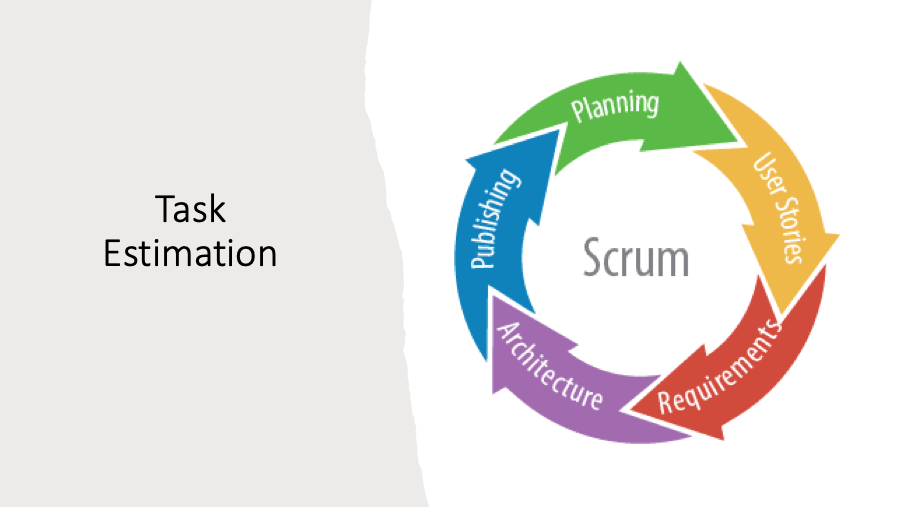
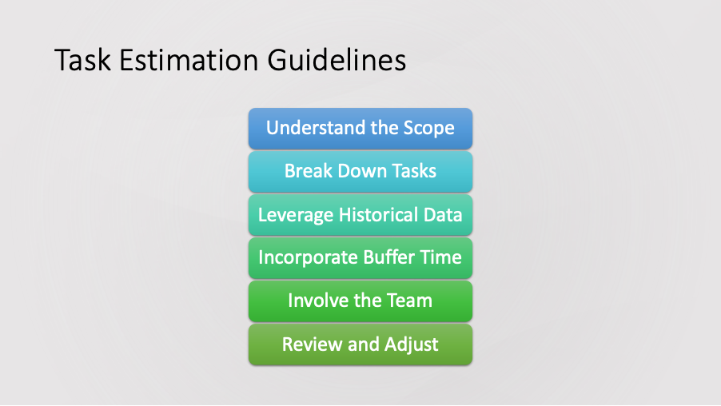
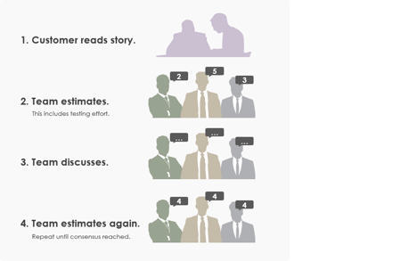
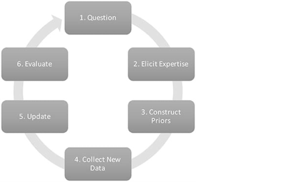
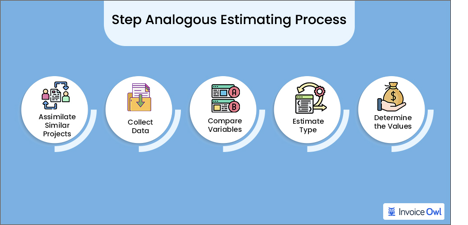

# Task Estimation

### Resources:
- [Should Testers Play Planning Poker?](https://developsense.com/blog/2011/10/should-testers-play-planning-poker)
- [Evidence-based Estimation](https://www.scrum.org/resources/blog/evidence-based-estimation)
- [How to Estimate Projects in Agile](https://www.netsolutions.com/insights/how-to-estimate-projects-in-agile/)
- [Why You Should Not Estimate in Hours or Days](https://www.scrumexpert.com/knowledge/why-you-should-not-estimate-in-hours-or-days/)
- [Agile Planning](https://bigpicture.one/blog/agile-planning/)
- [Story Points](https://asana.com/resources/story-points)
- [Are We Really Bad at Estimating?](https://www.mountaingoatsoftware.com/blog/are-we-really-bad-at-estimating)

Task estimation is an important component of software development and project management, resource allocation and project delivery. This involves predicting the most realistic amount of effort, estimation is measured usually in hours, days or story points when required to complete a task or project. Task estimation helps project managers and teams align expectations, set deadlines and manage stakeholder’s interests. 

## Effective Task Estimation Guidelines

1. **Understand the Scope:** To guarantee that everyone in the team is aware of the goals, clearly define the project and task boundaries.
2. **Break Down Tasks:** To increase the accuracy of your estimations, break up enormous jobs into smaller, more manageable pieces.
3. **Leverage Historical Data:** To estimate similar tasks for the present project, utilize historical data from previous projects as a baseline.
4. **Incorporate Buffer Time:** Include buffer time into the estimations to account for uncertainty and unexpected roadblocks.
5. **Involve the Team:** Involve the people who will be carrying out the tasks in the estimation process so that you may benefit from their knowledge and perspectives.
6. **Review and Adjust:** Treat estimates as dynamic elements of the project plan that need to be examined and modified in response to new information.

## Techniques of Task Estimation

### Planning Poker

Planning Poker, also known as Scrum Poker, is an estimation technique that uses the collective wisdom of the project team to achieve more accurate estimates.

There are 5 steps to Planning Poker

1. Each team member receives a set of cards marked with a number representing a unit of estimation. These numbers usually follow a Fibonacci series to account for uncertainty and complexity of tasks.
2. Each task has to be estimated. A moderator presents the item to team and clarifies any doubt.
3. Team members must choose a card on their own representing their estimate of the effort required for the task. Once everyone has selected a card, all cards are revealed at the same time.
4. The members with the highest and lowest estimations debate their rationale if there is a large difference in the estimates. This stage assists in identifying any presumptions or insights that the team as a whole may not have taken into account.
5. The whole estimation process is repeated until the team reaches a consensus on the effort required.

### Expert Judgement

Expert judgment involves communicating with one or more individuals with experience and expertise relevant to the tasks or projects at hand. This relies on the knowledge of seasoned professionals who can draw on their past experiences to provide estimates.

Expert judgement includes being able to identify experts within or outside the team who have a deep understanding of the challenge and requirements. Being able to present tasks to the experts and ask for their estimation from their previous experience. Consolidating the feedback from consulted experts at the final estimate.

### Analogous Estimation

Analogous Estimation is used where the team estimates the effort required for a task by comparing it to similar tasks or projects that have been completed in the past. 
The steps involved are 
- Reviewing historical data to find any completed tasks that are similar in size, complexity and scope
- Adjusting the estimates based on any differences from the past tasks and current tasks
- Using the adjusted estimates as a basis for the new project’s estimates

This estimation is the most effective when there is a vast amount of historical data available but it’s not as accurate for novel or unique tasks. It is quick and easy and suitable for early-stage project planning.

## Benefits and Downfalls 
Different task estimation techniques have their own benefits and downfalls, and their effectiveness can change depending on the specific scenario or context in which they're used.

### Planning Poker
#### Benefits:
- Promotes team collaboration and discussion, leading to well-informed estimates.
- Takes into account different perspectives, which can lead to more accurate estimates.
- The iterative approach helps in reaching a consensus, reducing the chances of a lot of variations in the actual effort.

#### Downfalls:
- Can be time-consuming, especially for large projects with many tasks.
- Might create biased results if team members are influenced by each other's estimates.

### Expert Judgment
#### Benefits:
- Leverages the experience and expertise of seasoned professionals.
- Can be more accurate for complex or specialized tasks.
 
#### Downfalls:
- Relies heavily on the availability and accuracy of the experts on the team.
- May not be as effective for novel tasks that the experts have no experience with.
 
### Analogous Estimation
#### Benefits:
- Quick and easy to implement, especially for early-stage project planning.
- Uses historical data, which can be a reliable source of estimates for tasks that are similar.
 
#### Downfalls:
- May not be accurate for unique or novel tasks.
- Heavily depends on the quality and relevance of the historical data available.
 
Overall the choice of the task estimation technique should be chosen based off the requirments of the task or project, the availability of historical data or experts, and the composition and dynamics of the team.